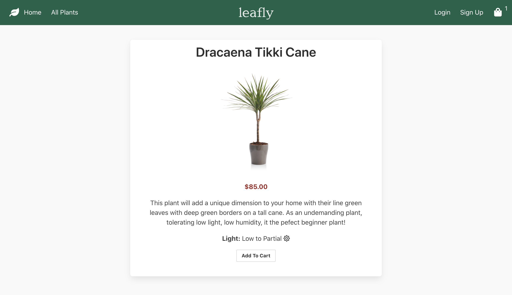
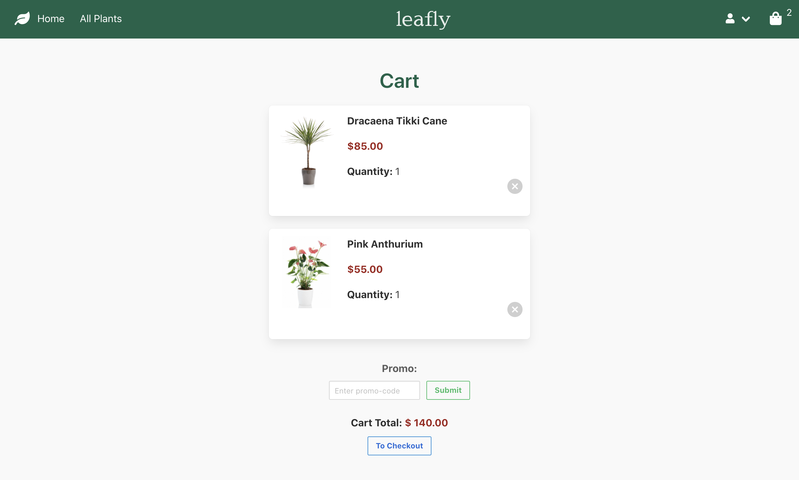

# leafly

[](https://travis-ci.com/Genius-Guava/Grace-Shopper)

# Overview

# Technologies

Javascript, Node.js, React, Redux, Express, Sequelize, PostgreSQL, Heroku, Travis, Bulma, HTML, CSS

## Development Mode Setup & Installation

```
// Create database using PostgreSQL
createdb grace-shopper
// Install all node.js dependencies
npm install
// Seed the database
npm run seed
// Run app on local server
npm run start-dev
// Run tests
npm run test
```

## Screenshots






## Dev Team Group Members

:leaves: Carly Dispasquela - Fullstack Developer
:leaves: Elijah Meshnick - Fullstack Developer
:leaves: Khrystyna Tsiupa - Fullstack Developer
:leaves: Jenny Zeng - Fullstack Developer
